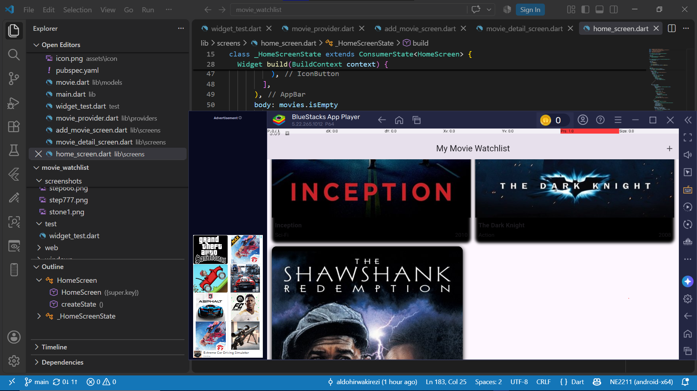
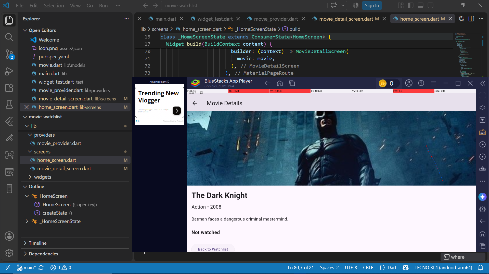
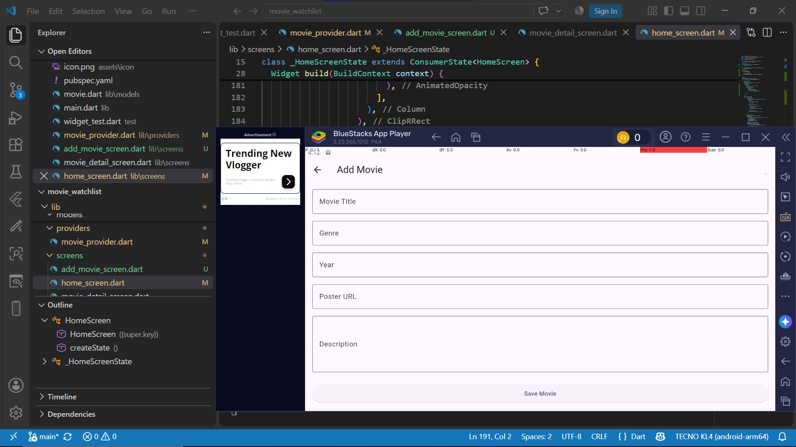

# Movie Watchlist

**Student:** Kirezi Hirwa Aldo
**Registration Number:** 2401000842
**Project:** Movie Watchlist
**Course:** Mobile Application Development
**Framework:** Flutter

## 1. Project Description

Movie Watchlist is a Flutter mobile application that helps users organize movies they want to watch. The application allows users to view movies in a grid, open a movie to see its details, add new movies through a validated form, mark movies as watched, and keep movie information saved locally. The application was developed to provide a simple way of managing a personal movie collection while demonstrating important Flutter concepts such as Riverpod state management, navigation, animations, form validation, JSON serialization, and local data persistence.

## 2. Main Features

* Display movies using a GridView.
* View detailed information about a selected movie.
* Add new movies using a form.
* Validate movie information before saving.
* Mark movies as watched.
* Remove movies from the watchlist.
* Display an empty state when there are no movies.
* Save movie information locally.
* Use Hero animation for movie posters.
* Use AnimatedContainer and AnimatedOpacity.
* Provide user feedback using SnackBar messages.
* Use a custom application launcher icon.

## 3. Screenshots

### Home / Movie Grid



*Figure 1: The home screen displays movies using a GridView.*

### Movie Details



*Figure 2: The movie detail screen displays information received from the selected Movie object.*

### Add Movie



*Figure 3: The Add Movie screen allows the user to enter and validate movie information.*

> The repository also contains milestone screenshots M1.png through M8.png where available.

## 4. Technologies Used

| Technology                    | Purpose                      |
| ----------------------------- | ---------------------------- |
| Flutter                       | Mobile application framework |
| Dart                          | Programming language         |
| Riverpod                      | State management             |
| shared_preferences            | Local data persistence       |
| JSON                          | Movie data serialization     |
| Git                           | Version control              |
| GitHub                        | Source-code hosting          |
| Android Studio / Android SDK  | Android development          |
| BlueStacks / Android Emulator | Application testing          |

## 5. Folder Structure

```text
movie_watchlist/
│
├── lib/
│   ├── main.dart
│   │
│   ├── models/
│   │   └── movie.dart
│   │
│   ├── providers/
│   │   └── movie_provider.dart
│   │
│   ├── screens/
│   │   ├── home_screen.dart
│   │   ├── movie_detail_screen.dart
│   │   └── add_movie_screen.dart
│   │
│   └── widgets/
│
├── assets/
│   └── icon/
│       └── icon.png
│
├── screenshots/
│   ├── M1.png
│   ├── M2.png
│   ├── M3.png
│   ├── M4.png
│   ├── M5.png
│   ├── M6.png
│   ├── M7.png
│   └── M8.png
│
├── android/
├── pubspec.yaml
├── README.md
└── .gitignore
```

## 6. How to Run the Project

Clone the repository:

```bash
git clone https://github.com/aldohirwakirezi/2401000842_Aldo_flutter_weekend.git
```

Enter the project directory:

```bash
cd 2401000842_Aldo_flutter_weekend
```

Install the dependencies:

```bash
flutter pub get
```

Run the application:

```bash
flutter run
```

To run using Chrome:

```bash
flutter run -d chrome
```

To build the release APK:

```bash
flutter build apk --release
```

The release APK will be generated at:

```text
build/app/outputs/flutter-apk/app-release.apk
```

## 7. State Management

The application uses Riverpod for state management.

The main provider is:

```text
movieProvider
```

The provider uses `MovieNotifier` to manage the movie collection.

The notifier supports operations such as:

* Adding a movie
* Removing a movie
* Changing watched status
* Loading saved movies
* Saving movies locally

## 8. Data Persistence

The application uses `shared_preferences` to store the movie collection locally.

Movie objects are converted into JSON using `toJson()` before they are saved. When the application loads saved data, `fromJson()` converts the stored JSON data back into Movie objects.

This allows movie information to remain available after the application is restarted.

## 9. Navigation

The application contains multiple screens.

The main navigation flow is:

```text
Home Screen
    │
    ├── Select Movie
    │       ↓
    │   Movie Detail Screen
    │
    └── Add Movie
            ↓
       Add Movie Screen
```

The selected Movie object is passed from the home screen to the movie detail screen.

## 10. Animations

The application includes:

### AnimatedContainer

Used to animate changes to the movie card.

### AnimatedOpacity

Used to smoothly change the visibility of movie information.

### Hero

Used to create a transition between the movie poster on the home screen and the same poster on the detail screen.

## 11. Form Validation

The Add Movie form validates important information before a movie is added.

The application checks:

* Movie title
* Genre
* Year
* Poster URL
* Description

If invalid information is entered, the user receives feedback instead of the movie being saved.

## 12. Known Limitations

1. Movie information is entered manually rather than being retrieved automatically from an online movie database API.

2. Poster images depend on the URL provided by the user, so an invalid or unavailable image URL may prevent the poster from displaying correctly.

3. The application currently uses local persistence, so movie data is stored on the device rather than synchronized between multiple devices.

4. The application does not currently provide user accounts or cloud synchronization.

## 13. Future Improvements

Possible future improvements include:

* Connecting the application to a movie database API.
* Adding movie search functionality.
* Adding categories and filtering.
* Adding cloud synchronization.
* Adding user accounts.
* Adding ratings and favorites.
* Improving offline image handling.

## 14. Project Repository

GitHub repository:

https://github.com/aldohirwakirezi/2401000842_Aldo_flutter_weekend

## 15. Author

**Kirezi Hirwa Aldo**
**Registration Number: 2401000842**
**University of Kigali – Musanze Campus**
